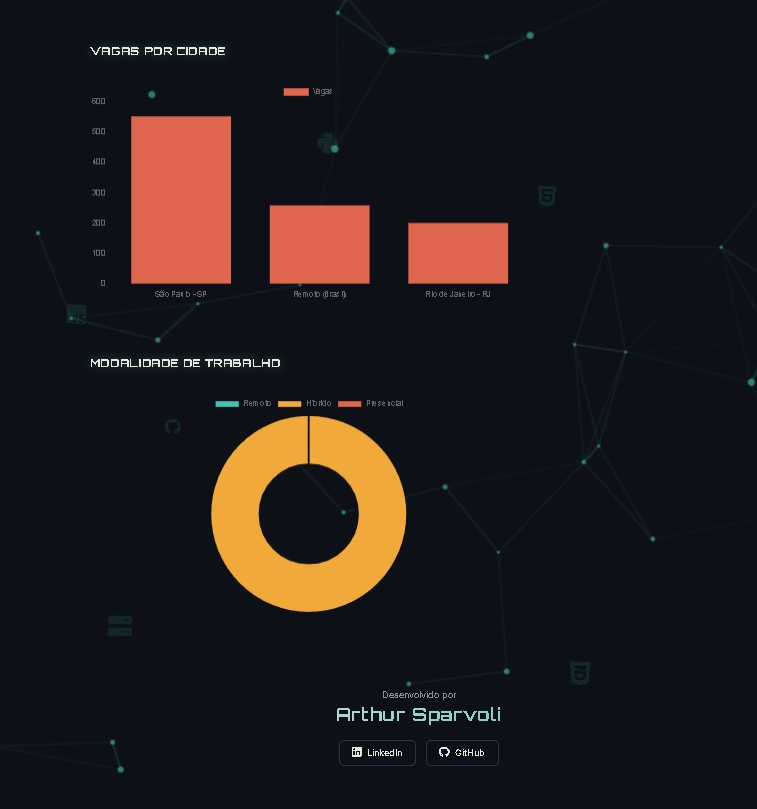
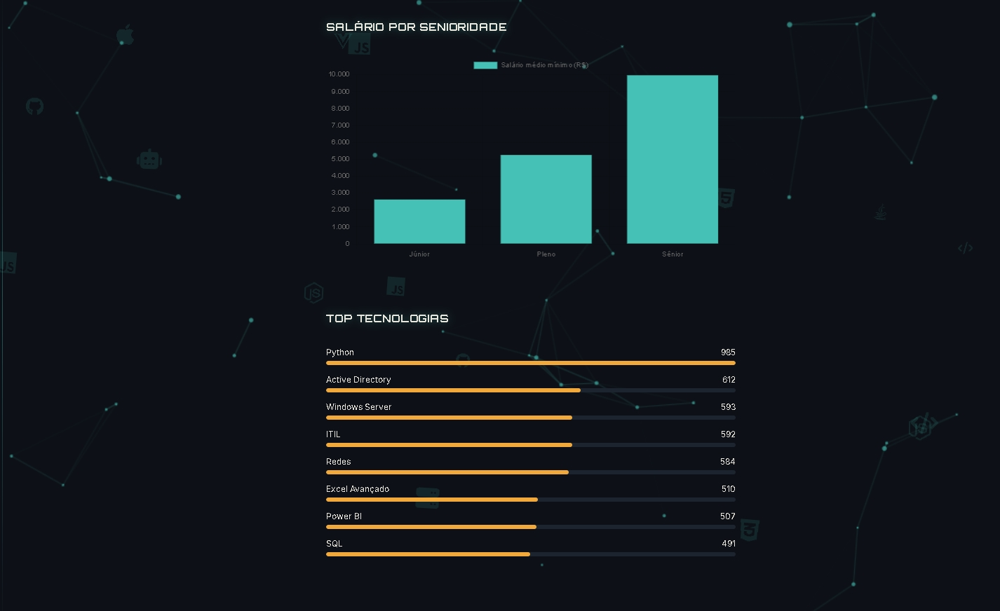
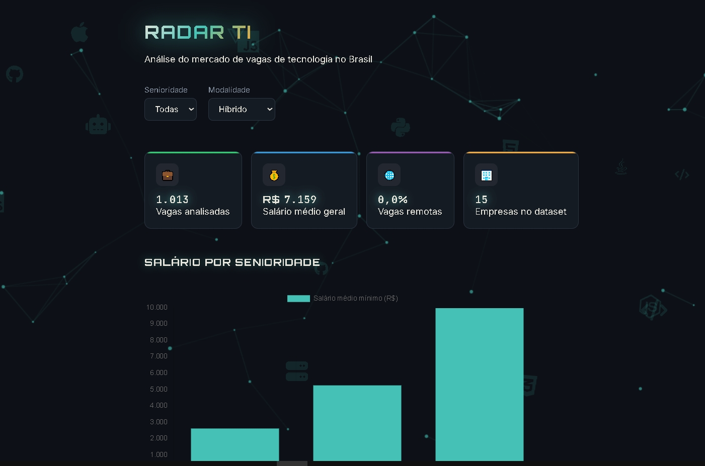

# Radar TI — Análise do Mercado de Vagas de Tecnologia

Pipeline de dados completo, do zero à nuvem, com dashboard web interativo — construído para analisar o mercado de vagas de TI no Brasil.

## 🚀 Sobre o projeto

Esse projeto nasceu como um estudo prático de Data Engineering e Front-end, cobrindo toda a cadeia: geração e tratamento de dados, modelagem relacional, processamento distribuído, cloud e uma aplicação web completa com backend próprio.

## 🛠️ Stack utilizada

**Dados & Backend**
- Python (geração de dados sintéticos, ETL, análise)
- SQL / SQLite (modelagem relacional, queries analíticas)
- PySpark (processamento distribuído local)
- Databricks Free Edition (Spark na nuvem, dashboards nativos)
- Flask + Flask-CORS (API REST)

**Front-end**
- HTML5 / CSS3 (Grid, Flexbox, animações customizadas)
- JavaScript (Canvas API, Fetch API, manipulação de DOM)
- Chart.js (visualização de dados)
- Anime.js (animações avançadas)

## 📊 Funcionalidades

- Geração de dataset sintético de 3.000 vagas, com regras de negócio coerentes (salário por senioridade, stacks por área)
- Pipeline SQL completo: schema normalizado, JOINs, agregações, window functions
- Mesma análise replicada em SQLite, PySpark local e Databricks (Spark na nuvem)
- API REST em Flask servindo os dados calculados em tempo real
- Dashboard interativo com:
  - Filtros dinâmicos (senioridade + modalidade) que recalculam gráficos e métricas sem recarregar a página
  - Fundo de partículas com física de repulsão ao mouse e conexões dinâmicas
  - Ícones de tecnologia flutuantes gerados dinamicamente
  - Animações de entrada, scroll reveal e micro-interações

## 🖼️ Screenshots

## 📁 Estrutura do projeto

## ▶️ Como rodar localmente

1. Clone o repositório
2. Gere os dados: `cd data && python gerar_dados.py`
3. Crie e popule o banco: `cd database && python criar_banco.py && python carregar_dados.py`
4. Suba a API: `cd backend && pip install flask flask-cors && python app.py`
5. Abra `dashboard_web/index.html` com Live Server (ou qualquer servidor local)

## 👨‍💻 Autor

**Arthur Sparvoli**

